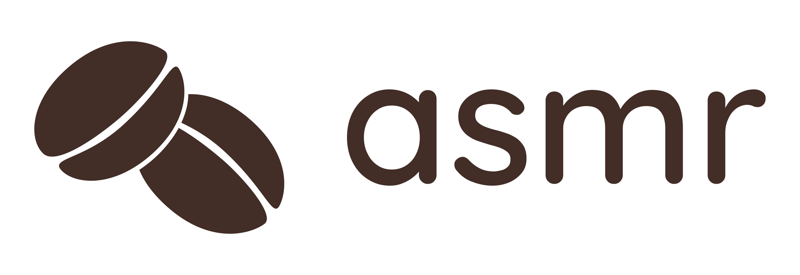

<!-- PROJECT SHIELDS -->
[![Contributors][contributors-shield]][contributors-url]
[![Forks][forks-shield]][forks-url]
[![Stargazers][stars-shield]][stars-url]
[![BSD 3-Clause License][license-shield]][license-url]

<!-- PROJECT LOGO -->
<br />
<div align="center">
  <a href="https://asmr.hamzahjundi.me/">
    
  </a>

<h3 align="center">asmr</h3>

  <p align="center">
    A simple Coffee Beans management solution
    <br />
    <a href="https://asmr.hamzahjundi.me">Visit Web Dashboard</a>
  </p>
</div>


<!-- TABLE OF CONTENTS -->
<details>
  <summary>Table of Contents</summary>
  <ol>
    <li>
      <a href="#about-asmr">About asmr</a>
      <ul>
        <li><a href="#built-with">Built With</a></li>
      </ul>
    </li>
    <li>
      <a href="#getting-started">Getting Started</a>
      <ul>
        <li><a href="#prerequisites">Prerequisites</a></li>
        <li><a href="#installation">Installation</a></li>
      </ul>
    </li>
    <li><a href="#usage">Usage</a></li>
    <li><a href="#license">License</a></li>
    <li><a href="#contact">Contact</a></li>
  </ol>
</details>


<!-- ABOUT ASMR -->
## About asmr

[![asmr Light Mode][product-screenshot]](https://asmr.hamzahjundi.me/)

[![asmr Dark Mode][product-screenshot-dark]](https://asmr.hamzahjundi.me/)

**asmr** is your solution for coffee beans management. You can manage your bean inventory, track down green bean to roasted bean production, and manage roasted bean transaction. You can also see the production report to see how well your bean is being roasted.

To be able to access **asmr** on your workplace, you need to contact your workplace Administrator and provide the information about your employment information. The Administrator then will be able to register and grant you access to the system.

<p align="right">(<a href="#top">back to top</a>)</p>


### Built With

Powered by [NET 6.0](https://dotnet.microsoft.com) and [React](https://reactjs.org/).

<p align="right">(<a href="#top">back to top</a>)</p>


<!-- GETTING STARTED -->
## Getting Started

To get a local copy up and running follow these simple example steps.

### Prerequisites

Please make sure have you following installed.
- [NET SDK 6.0 or newer](https://dotnet.microsoft.com/download/dotnet/6.0/)
- [NodeJS 16 or newer](https://nodejs.org/)
- [Yarn Package Manager](https://classic.yarnpkg.com/)

### Installation

1. Clone this repo
   ```sh
   git clone https://github.com/danang-id/asmr.git
   cd asmr
   ```
2. Install NPM packages
   ```sh
   cd ASMR/Web
   yarn install
   ```
3. Generate a X509 certificate with PCKS#8 RSA private key. You may want to use [CertificateTools.com]
   (https://certificatetools.com) to generate this certificate. Download the certificate and save it to
   `ASMR.Web/Keys/DataProtectionCertificate.pfx`. If you set up a password for the certificate, you
   should configure the password on the `appsettings.Local.json` as described below.
4. Generate a long random string for JSON Web Token (JWT) key, and configure that to the
   `appsettings.Local.json` as described below.
5. Prepare Google reCAPTCHA Secret Key. You can obtain it on the
   [Google reCAPTCHA Admin Panel](https://www.google.com/recaptcha/admin).
6. Prepare SendGrid API Key, Contact List Id, and Mail Templates Id. You can obtain them on the
   [SendGrid Dashboard](https://app.sendgrid.com).
7. Save those secrets by creating `appsettings.Local.json` file (if not exists) in the `ASMR.Web`
   folder. Use the following template for `appsettings.Local.json`.
   ```json
   {
      "DataProtection": {
         "Certificate": {
            "Password": ""
         }
      },
      "JsonWebToken": {
         "Key": ""
      },
      "Google": {
         "reCAPTCHA": {
            "SecretKey": ""
         }
      },
      "SendGrid": {
         "ApiKey": "",
         "ContactListId": "",
         "Templates": {
            "EmailAddressConfirmation": "",
            "EmailAddressChanged": "",
            "RegistrationPendingApproval": "",
            "RegistrationRejected": "",
            "Welcome": "",
            "PasswordReset": ""
         }
      }
   }
   ```


<p align="right">(<a href="#top">back to top</a>)</p>


## Run and Build

To run this application for development, follow these steps.
1. Open Terminal / Command Prompt at `ASMR.Web/ClientApp` folder, and type:
   ```sh
   yarn start
   ```
2. Open Terminal / Command Prompt at `ASMR.Web` folder, and type:
   ```sh
   dotnet run
   ```

To build this application for release, follow these steps.
1. Open Terminal / Command Prompt at `ASMR.Web/ClientApp` folder, and type:
   ```sh
   yarn build
   ```
2. Open Terminal / Command Prompt at `ASMR.Web` folder, and type:
   ```sh
   make release
   ```

Make sure you have `make` installed. If you are on Windows, follow the answer of this question on the
[StackOverflow](https://stackoverflow.com/questions/32127524/how-to-install-and-use-make-in-windows).
The binary output should be in the `ASMR.Web/Releases` folder.

<p align="right">(<a href="#top">back to top</a>)</p>


## License

This project is licensed under the BSD 3-Clause License. See [`LICENSE.md`](LICENSE.md) for more information.

<p align="right">(<a href="#top">back to top</a>)</p>


## Contact

Danang Galuh Tegar Prasetyo - [@dananggaluht](https://twitter.com/dananggaluht) - connect@danang.id

Project Link: [https://github.com/danang-id/asmr](https://github.com/danang-id/asmr)

<p align="right">(<a href="#top">back to top</a>)</p>


<!-- https://www.markdownguide.org/basic-syntax/#reference-style-links -->
[contributors-shield]: https://img.shields.io/github/contributors/danang-id/asmr.svg?style=for-the-badge
[contributors-url]: https://github.com/danang-id/asmr/graphs/contributors
[forks-shield]: https://img.shields.io/github/forks/danang-id/asmr.svg?style=for-the-badge
[forks-url]: https://github.com/danang-id/asmr/network/members
[stars-shield]: https://img.shields.io/github/stars/danang-id/asmr.svg?style=for-the-badge
[stars-url]: https://github.com/danang-id/asmr/stargazers
[license-shield]: https://img.shields.io/github/license/danang-id/asmr.svg?style=for-the-badge
[license-url]: https://github.com/danang-id/asmr/blob/master/LICENSE.md
[product-screenshot]: Docs/screenshot.png
[product-screenshot-dark]: Docs/screenshot-dark.png
